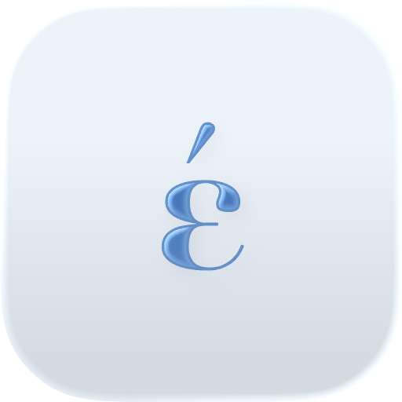

<p align="center">
  
  &nbsp;&nbsp;
  
</p>

# ela — Greek accents, typed for you

**ela** is a tiny macOS menu-bar app that adds the stress mark (τόνος) to Greek
words **as you type — without you pressing the accent key.** Type on the Greek
layout the way it sounds, and ela puts the accent on the right syllable, picking
the correct one from context.

```
you type      ela writes
─────────     ──────────
καλημερα   →  καλημέρα
ευχαριστω  →  ευχαριστώ
τι κανεις? →  τι κάνεις;          ( ?  becomes the Greek question mark ; )
```

Some Greek words are spelled the same without an accent but mean different
things depending on where the stress lands. ela reads the sentence to choose:

```
δεν θα το κανω ποτε.   →  δεν θα το κάνω ποτέ.     (ποτέ = never)
ποτε θα ερθεις;        →  πότε θα έρθεις;          (πότε = when)
θελω αλλα δυο          →  θέλω άλλα δύο            (άλλα = more)
ηρθαν ολοι αλλα εφυγαν →  ήρθαν όλοι αλλά έφυγαν   (αλλά = but)
```

It even fixes itself: if the start of a sentence was ambiguous, ela re-reads the
**whole sentence when you finish it** and corrects earlier words.

---

## Why you might like it

- **It just works while you type.** No special key, no mode. Type Greek without
  accents; the accents appear.
- **Context-aware.** Handles look-alike words (πότε/ποτέ, νόμος/νομός, άλλα/αλλά…)
  using the words around them.
- **Learns your habits.** Adapts to the words and phrases you use most.
- **Greek question mark.** Optionally turns a typed `?` into `;`.
- **English & Greek interface**, switchable from the menu.
- **Featherweight & native.** Pure AppKit, no frameworks bundled, ~7 MB of RAM,
  instant launch, lives quietly in the menu bar.
- **100% on your Mac.** No network, no account, no telemetry. Your learned data
  stays in a local file you can delete anytime.

---

## Install

Requires **macOS 26 (Tahoe)** and Xcode command-line tools.

```bash
git clone https://github.com/tahdisto/ela.git
cd ela
./build-app.sh          # builds ela.app (signed with your local identity)
open ela.app
```

**First run:**
1. macOS asks for **Accessibility** permission — grant it to `ela`
   (System Settings → Privacy & Security → Accessibility). This is what lets ela
   rewrite the word you just typed. ela picks it up automatically, no relaunch.
2. Switch your keyboard to the **Greek** input source.
3. Start typing — without accents.

ela only does anything while the **Greek** layout is active; on any other layout
every keystroke passes straight through.

---

## The menu

The menu-bar glyph is **ε** when idle and **έ** when active.

| Item | What it does |
|------|--------------|
| **Enabled** | Master switch. Turn it off and ela leaves everything you type untouched (the options below grey out). |
| **Correct accents at sentence end** | When you finish a sentence (`.` `;` `!` `?` `·` ⏎), ela re-reads it whole and fixes accents that depend on later words. |
| **Learn from Typing** | Lets ela adapt to the words and phrases you use most. |
| **Greek question mark (? → ;)** | Type `?` and get the Greek question mark `;`. |
| **Language** | English or Ελληνικά. |
| **Clear Learning Data** | Forget everything ela has learned. |

---

## How it works (short version)

ela watches typing on the Greek layout and inserts accents on the fly.

- A small **on-device model** (built from a public Greek text corpus) maps each
  unaccented word to its accented form. ~95% of words have exactly one answer —
  a straight lookup.
- The tricky ~5% are **homographs**. For those, ela scores the candidates with
  the neighbouring words (a bigram model) plus what you’ve taught it, and picks
  the best fit. When the sentence ends, it re-scores with the full sentence.
- Text is rewritten with synthesized keystrokes (a `CGEventTap` watches the
  Greek layout; backspace + re-insert the corrected word).

The model is memory-mapped, so the app loads instantly and stays around ~7 MB of
RAM. Accuracy on held-out Greek text: **98.4%** of all words, **91.6%** on the
ambiguous homographs (vs. 89.6% for a naive most-frequent guess).

More detail and the accuracy harness live in [`engine/`](engine/) and
[`scripts/build_model.py`](scripts/build_model.py).

---

## Build, test, hack

```bash
swift build -c release            # library + CLI + app

# try the accent engine from the terminal
.build/release/accent "ποτε θα ερθεις"        # → πότε θα έρθεις
.build/release/accent --eval data/model/test.txt   # accuracy on held-out text

# verify the typing/rewrite logic headlessly (no UI, no permissions)
.build/release/ela --selftest
```

Project layout:

```
engine/Sources/GreekAccent   the accent engine (model, lookup, scoring, learning)
engine/Sources/accent        CLI + accuracy harness
app/Sources/ela              the menu-bar app (AppKit, event tap, composer)
scripts/build_model.py       rebuilds the model from a Greek corpus
scripts/make_icon.swift      renders the app icon
build-app.sh                 assembles & signs ela.app
```

Rebuilding the model needs the [Leipzig Corpora](https://wortschatz.uni-leipzig.de/en/download)
Greek files in `data/raw/` (see the script). The prebuilt model ships in
`data/model/`.

---

## Privacy

Everything runs locally. ela makes no network requests. What it learns is saved
to `~/Library/Application Support/ela/learning.json` — delete it (or use *Clear
Learning Data*) to reset.

It does need **Accessibility** permission, because rewriting the word you typed
means reading keystrokes and sending backspaces. That access never leaves your
Mac.

---

## Limitations

- Some rare ambiguous words still need to be learned before ela gets them right.
- Replacement uses synthesized keystrokes, so very unusual text fields (some
  terminals, password fields) may behave differently.
- Built and tested on macOS 26 (Tahoe), Apple Silicon.

---

## License

MIT — see [LICENSE](LICENSE).

Greek language data derived from the **Leipzig Corpora Collection** (CC BY).
